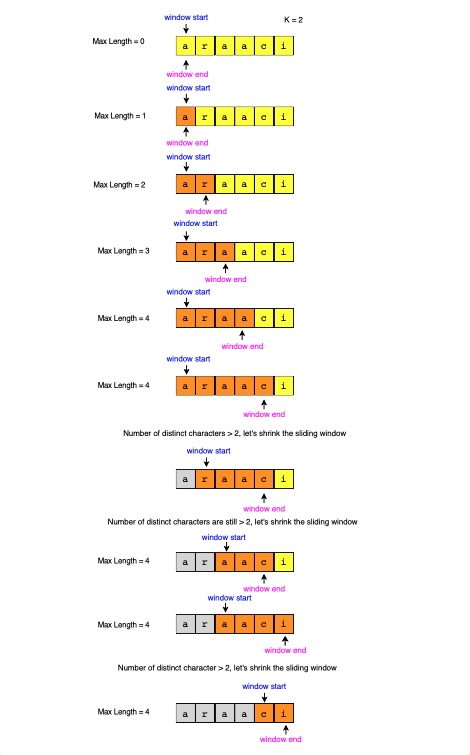

## Longest Substring with maximum K Distinct Characters (medium)

### Problem Statement

Given a string, find the length of the **longest substring** in it with **no more than K distinct characters**.

**Example 1:**

```java
Input: String="araaci", K=2
Output: 4
Explanation: The longest substring with no more than '2' distinct characters is "araa".
```

**Example 2:**

```java
Input: String="araaci", K=1
Output: 2
Explanation: The longest substring with no more than '1' distinct characters is "aa".
```

**Example 3:**

```java
Input: String="cbbebi", K=3
Output: 5
Explanation: The longest substrings with no more than '3' distinct characters are "cbbeb" & "bbebi".
```

**Example 4:**

```java
Input: String="cbbebi", K=10
Output: 6
Explanation: The longest substring with no more than '10' distinct characters is "cbbebi".
```

### Solution

This problem follows the Sliding Window pattern, and we can use a similar dynamic sliding window strategy as discussed in [Smallest Subarray](../Smallest_Sub_Array/README.md) with a given sum.

We can use a HashMap to remember the frequency of each character we have processed.

Here is how we will solve this problem:

1. First, we will insert characters from the beginning of the string until we have K distinct characters in the HashMap.
   <br/>

2. These characters will constitute our sliding window. We are asked to find the longest such window having **no more than K distinct characters**. We will remember the length of this window as the longest window so far.
   <br/>

3. After this, we will keep adding one character in the sliding window (i.e., slide the window ahead) in a **stepwise manner**
   <br/>

4. In **each step**, we will try to **shrink** the window from the beginning if the count of distinct characters in the **HashMap** is larger than K. We will shrink the window until we have no more than K distinct characters in the HashMap. This is needed as we intend to find the longest window.
   <br/>

5. While shrinking, we’ll decrement the character’s frequency going out of the window and remove it from the HashMap if its frequency becomes zero.
   <br/>

6. At the end of each step, we’ll check if the current window length is the longest so far, and if so, remember its length.
   <br/>

##### Visual Steps


<br/>

#### Code

```java
  public static int findLength(String str, int k) {
    if (str == null || str.length() == 0)
      throw new IllegalArgumentException();

    int windowStart = 0, maxLength = 0;
    Map<Character, Integer> charFrequencyMap = new HashMap<>();
    // in the following loop we'll try to extend the range [windowStart, windowEnd]
    for (int windowEnd = 0; windowEnd < str.length(); windowEnd++) {
      char rightChar = str.charAt(windowEnd);
      charFrequencyMap.put(rightChar, charFrequencyMap.getOrDefault(rightChar, 0) + 1);
      // shrink the sliding window, until we are left with 'k' distinct characters in the frequency map
      while (charFrequencyMap.size() > k) {
        char leftChar = str.charAt(windowStart);
        charFrequencyMap.put(leftChar, charFrequencyMap.get(leftChar) - 1);
        if (charFrequencyMap.get(leftChar) == 0) {
          charFrequencyMap.remove(leftChar);
        }
        windowStart++; // shrink the window
      }
      maxLength = Math.max(maxLength, windowEnd - windowStart + 1); // remember the maximum length so far
    }

    return maxLength;
  }
```

<br/>

#### Time Complexity: O(N)

<br/>

#### Space Complexity: O(1)

<be/>

[Code File](./LongestSubstringKDistinct.java) | [Go Back](../README.md)
