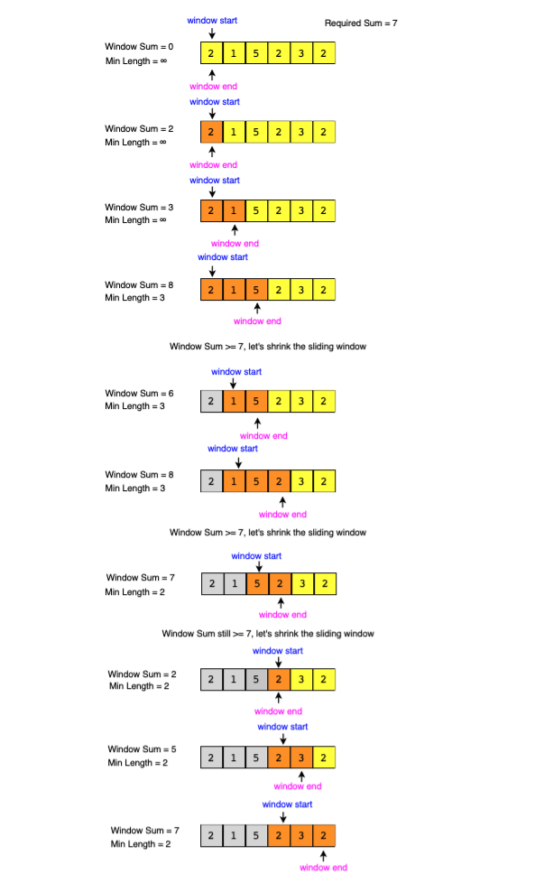

## Smallest Subarray with a given sum (easy)

### Problem Statement

Given an array of positive numbers and a positive number ‘S,’ find the length of the smallest contiguous subarray whose sum is greater than or equal to ‘S’. Return 0 if no such subarray exists.

**Example 1:**

```java
Input: [2, 1, 5, 2, 3, 2], S=7
Output: 2
Explanation: The smallest subarray with a sum greater than or equal to '7' is [5, 2].
```

**Example 2:**

```java
Input: [2, 1, 5, 2, 8], S=7
Output: 1
Explanation: The smallest subarray with a sum greater than or equal to '7' is [8].
```

**Example 3:**

```java
Input: [3, 4, 1, 1, 6], S=8
Output: 3
Explanation: Smallest subarrays with a sum greater than or equal to '8' are [3, 4, 1]
or [1, 1, 6].
```

### Solution

This problem follows the Sliding Window pattern, and we can use a similar strategy as discussed in Maximum Sum Subarray of Size K.

There is one difference though: in this problem, the sliding window size is not fixed.

Here is how we will solve this problem:

1. First, we will add-up elements from the beginning of the array until their sum becomes greater than or equal to ‘S.’
   <br/>
2. These elements will constitute our sliding window. We are asked to find the smallest such window having a sum greater than or equal to ‘S.’ We will remember the length of this window as the smallest window so far.
   <br/>
3. After this we will keep adding one element in the sliding window in a **stepwise manner**
   <br/>
4. On each **step**, we will also try to shrink the window from the start. We will shrink the window, until the window's usm is smaller than 'S' again.

- This is needed to find the smallest window.
- The shrinking will also happen in multiple steps, and on each step we need to do 2 things:

  - Check if the current window length is the smallest so far, and if so, remember its length.
  - Subtract the first element of the window from the running sum to shrink the sliding window.
    <br/>

##### Visual Steps


<br/>

#### Code

```java
class MinSizeSubArraySum {
  public static int findMinSubArray(int S, int[] arr) {
    int windowSum = 0, minLength = Integer.MAX_VALUE;
    int windowStart = 0;
    for (int windowEnd = 0; windowEnd < arr.length; windowEnd++) {
      windowSum += arr[windowEnd]; // add the next element
      // shrink the window as small as possible until the 'windowSum' is smaller than 'S'
      while (windowSum >= S) {
        minLength = Math.min(minLength, windowEnd - windowStart + 1);
        windowSum -= arr[windowStart]; // subtract the element going out
        windowStart++; // slide the window ahead
      }
    }

    return minLength == Integer.MAX_VALUE ? 0 : minLength;
  }
```

<br/>
#### Time Complexity: O(N)

<br/>
#### Space Complexity: O(1)

[Code File](./MinSizeSubArraySum.java)

[Go Back](../README.md)
